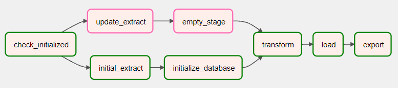
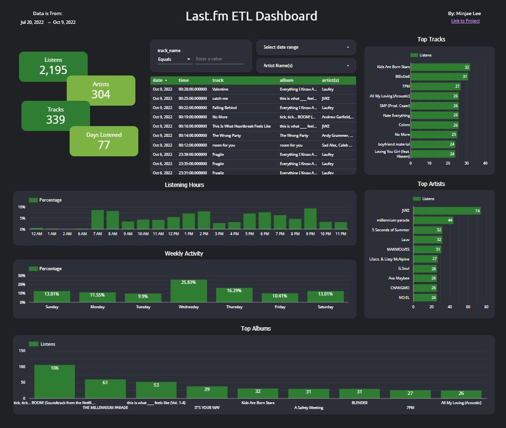

# Last.fm ETL
[Link to Last.fm ETL Dashboard](https://datastudio.google.com/reporting/3fb35501-1161-4b5e-9213-885770d2231d)

Data pipeline to extract music listening data using the [Last.fm Music Discovery API](https://www.last.fm/api). The project provides insight into personal music listening activity and trends.

On a technical level, the project is a showcase of Python, SQL, Pandas, ETL, dimensional modeling, and Airflow usage.

## ETL Architecture


1. Extract music listening data from [Last.fm Music Discovery API](https://www.last.fm/api)
2. Model data and generate staging and final database using star schema
3. Transform data using Python, Pandas, and SQLAlchemy to the staging layer
4. Load data from staging layer to final SQLite database
5. Export data to Google Data Studio for data visualization
6. Orchestrate tasks with Airflow


## Data Model


Dimension Tables:
`Date_DIM`
`Time_Of_Day_DIM`
`Track_DIM`
`Artist_Group_DIM`
`Artist_DIM`

Fact Tables:
`Listening_Fact`

The data model uses a star schema described in [The Data Warehouse Toolkit](https://www.kimballgroup.com/data-warehouse-business-intelligence-resources/books/data-warehouse-dw-toolkit/) by Ralph Kimball and Margy Ross. The `Time_Of_Day_DIM` is kept separate from the `Date_DIM` for flexibility and ease of managenent. The `Track_DIM` is a fixed depth hierarchy, modeling the relationship between tracks and albums. The `Artist_DIM` is connected to `Artist_Group_DIM` using a bridge table to keep track of listening activity with multiple artists. `Listening_Fact` is a factless fact table because the grain is one listening occurence which does not need to store additional metrics.

## Orchestration




The airflow DAG supports both **one time historic load** and **incremental batch loads** on the music listening data. The DAG is scheduled to run daily.

### Overview:
- `check_initialized`: BranchPythonOperator which selects between the incremental batch load and the initial one time historic load branches.
- `initial_extract`: ShortCircuitOperator which extracts all historic data from the [Last.fm Music Discovery API](https://www.last.fm/api). Skips tasks if no new data is available.
- `update_extract`: ShortCircuitOperator which extracts daily batch data from the [Last.fm Music Discovery API](https://www.last.fm/api). Skips tasks if no new data is available.
- `initialize_database`: PythonOperator which initializes staging area and final database schema according to the [data model](#data-model) above.
- `empty_stage`: PythonOperator which empties staging area for new data transformations
- `transform`: PythonOperator which transforms and formats data to fit the [data model](#data-model) above.
- `load`: PythonOperator which loads/appends transformed data from staging layer to final database.
- `export`: PythonOperator which exports database tables as csv for data visualization

## Dashboard
[](https://datastudio.google.com/reporting/3fb35501-1161-4b5e-9213-885770d2231d)

[Link to Last.fm ETL Dashboard](https://datastudio.google.com/reporting/3fb35501-1161-4b5e-9213-885770d2231d)

## Setup
- create .env file or replace variables in each file containing load_dotenv(): `extract_functions.py`, `init_db.py`, `empty_stage_.py`, `transform.py`, `load.py`, and `export.py`

```
DATABASE_LOCATION=sqlite:///listening_history.sqlite
DATABASE_NAME=listening_history.sqlite
STAGE_LOCATION=sqlite:///stage.sqlite
STAGE_NAME=stage.sqlite
USER_AGENT=LastfmUsername
API_KEY=dummyapikey123456
```

- change dag start date to previous day in last.fm_dag.py

```
'start_date': datetime.datetime(2022, 9, 19)
```

- convert to local timezone in transform.py
```
df["date"] = pd.to_datetime(df["date"]).dt.tz_convert('America/New_York')
```
