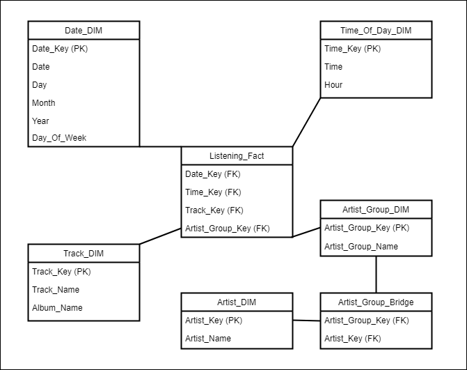

# Last.fm-ETL

## 1. Objective
The purpose of this project is to create an ETL pipeline for music listening data using the [Last.fm Music Discovery API](https://www.last.fm/api). This project will serve as a base for a more developed Music Statistic Tool in the future.

## 2. ETL Architecture

The data is sourced from [Last.fm Music Discovery API](https://www.last.fm/api) containing music listening history data. Airflow orchestrates the ETL process by running a scheduled python script to transform the data and loaded into an SQLite database and validated through DBeaver. The Last.fm data is requested in JSON format and requested data within a 24 hour timeframe is cached to reduce the number of API requests made to the data vendor. The initial run of the ETL will populate all previously recorded music listening data up to, but not including the current day's records. Post-setup, the script will add new listening history daily from the previous day.

## 3. Data Model

Dimension Tables:
`Date_DIM`
`Time_Of_Day_DIM`
`Track_DIM`
`Artist_Group_Bridge`
`Artist_DIM`

Fact Tables:
`Listening_Fact`

The data model uses a star schema described in [The Data Warehouse Toolkit](https://www.kimballgroup.com/data-warehouse-business-intelligence-resources/books/data-warehouse-dw-toolkit/) by Ralph Kimball and Margy Ross. The `Time_Of_Day_DIM` is kept separate from the `Date_DIM` for flexibility and ease of managenent. The `Track_DIM` is a fixed depth hierarchy modeling the relationship between tracks and albums. The `Artist_DIM` uses `Artist_Group_Bridge` as a bridge table to keep track of listening activity with multiple artists.