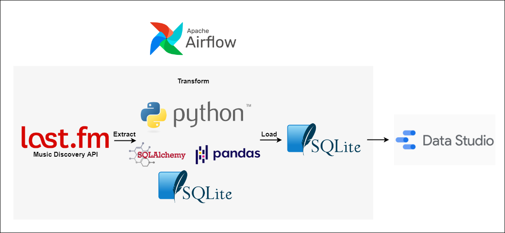

# Last.fm-ETL

## 1. Objective
The purpose of this project is to create an agile ETL pipeline and data model for music listening data using the [Last.fm Music Discovery API](https://www.last.fm/api). The project is primarily a showcase of Python programming and it is acknowledged that building an entire pipeline through Python is not an efficient method. Secondarily, the project serves as review and familiarizing myself with the ETL process, data modeling, and elementary Airflow utilization.

## 2. Setup
- create .env file or replace global variables in functions.py:

```
DATABASE_LOCATION=sqlite:///listening_history.sqlite
DATABASE_NAME=listening_history.sqlite
USER_AGENT=Username
API_KEY=example1api1key324fdg245
```

- change dag start date in last.fm_dag.py

```
'start_date': datetime.datetime(2022, 9, 19), # change to today
```

- convert to local timezone in transform.py
```
df["date"] = pd.to_datetime(df["date"]).dt.tz_convert('America/New_York')
```

## 3. ETL Architecture


The data is sourced from [Last.fm Music Discovery API](https://www.last.fm/api) containing music listening history data. Airflow schedules a one time historic load ETL pipeline. Python scripts are used to orchestrate the extract, transform, and load processes to an SQLite database. The Last.fm api requests are cached similar to storing raw data in data lakes before the staging layer for integrity and reduction of repeated API requests made during development and testing of the pipeline. The ETL process will populate all previously recorded music listening data into a star schema model deployed in SQLite.

## 4. Data Model


Dimension Tables:
`Date_DIM`
`Time_Of_Day_DIM`
`Track_DIM`
`Artist_Group_DIM`
`Artist_DIM`

Fact Tables:
`Listening_Fact`

The data model uses a star schema described in [The Data Warehouse Toolkit](https://www.kimballgroup.com/data-warehouse-business-intelligence-resources/books/data-warehouse-dw-toolkit/) by Ralph Kimball and Margy Ross. The `Time_Of_Day_DIM` is kept separate from the `Date_DIM` for flexibility and ease of managenent. The `Track_DIM` is a fixed depth hierarchy, modeling the relationship between tracks and albums. The `Artist_DIM` is connected to `Artist_Group_DIM` using a bridge table to keep track of listening activity with multiple artists. `Listening_Fact` is a factless fact table because the grain is one listening occurence which does not need to store additional metrics.
